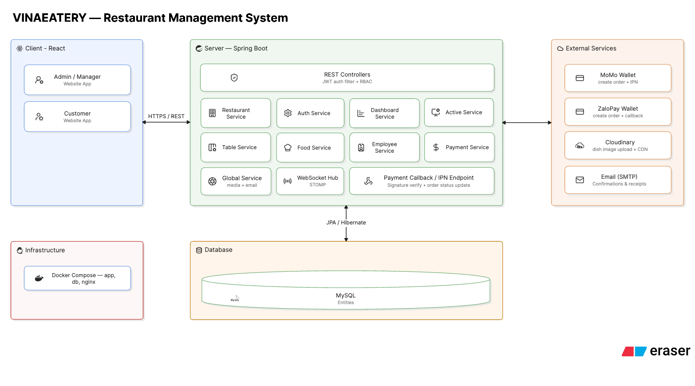
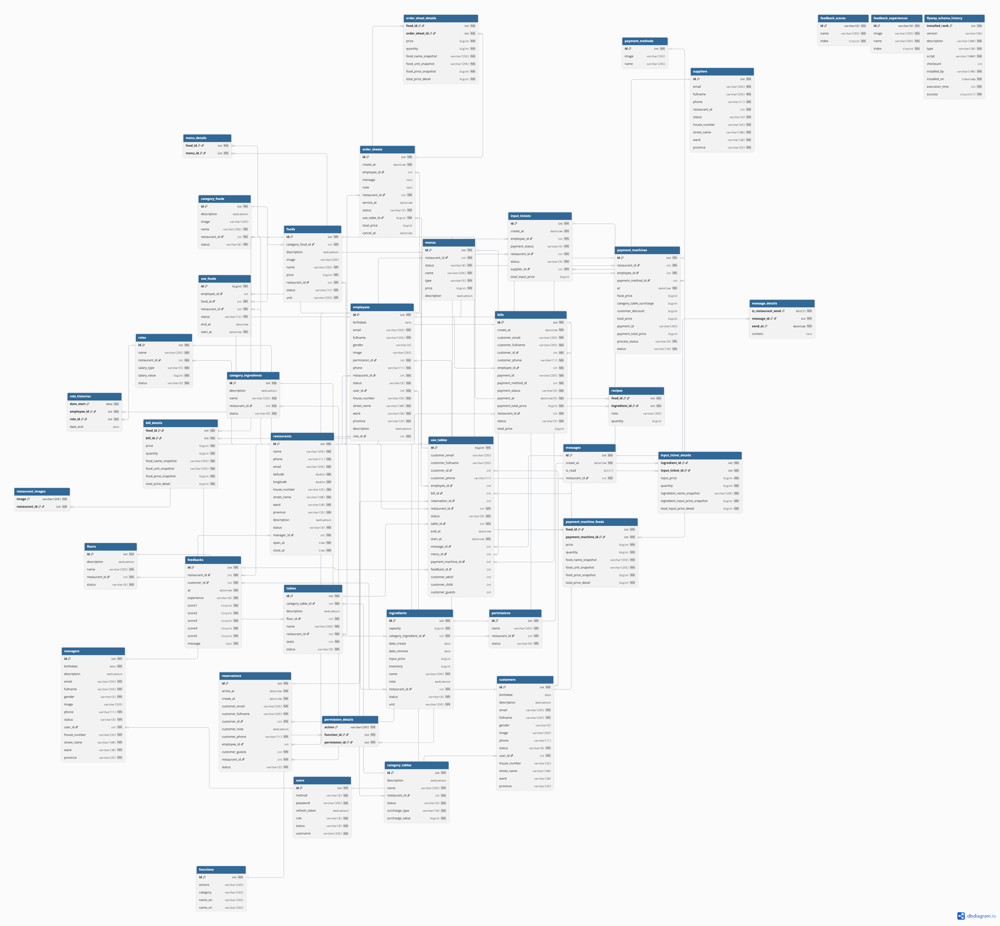

# VINAEATERY - Hệ thống quản lý nhà hàng thông minh

> Đồ án phát triển hệ thống quản lý nhà hàng sử dụng **Spring Boot**, **React** và **MySQL**, hỗ trợ quản lý toàn bộ quy trình vận hành từ nguyên liệu, món ăn, bàn ăn, gọi món đến thanh toán và báo cáo thống kê.

---

# Giới thiệu

VINAEATERY được xây dựng nhằm số hóa quy trình quản lý nhà hàng theo mô hình hiện đại, nơi khách hàng có thể tự gọi món ngay tại bàn thông qua website, trong khi nhân viên và quản lý có thể theo dõi toàn bộ hoạt động của nhà hàng theo thời gian thực.

Hệ thống được thiết kế theo hướng phân tách rõ các vai trò:

- Quản lý
- Chủ nhà hàng
- Nhân viên
- Khách hàng

Mỗi vai trò sẽ có giao diện và quyền truy cập riêng nhằm đảm bảo tính bảo mật cũng như thuận tiện trong quá trình sử dụng.

---

# Tính năng nổi bật

## Quản lý nhà hàng

- Quản lý nhà hàng: Hỗ trợ quản lý nhiều nhà hàng trong cùng một hệ thống
- Quản lý vận hành: Theo dõi trạng thái bàn và món ăn, quản lý thực đơn, phiếu gọi món, đặt bàn, hóa đơn và thanh toán
- Quản lý cơ sở vật chất: Quản lý tầng, loại bàn ăn và bàn ăn
- Quản lý thực đơn & nguyên liệu: Quản lý món ăn, danh mục món ăn, công thức chế biến, nguyên liệu, nhà cung cấp và phiếu nhập kho
- Quản lý nhân sự & phân quyền: Quản lý nhân viên, chức vụ và quyền hạn

## Khách hàng

- Quản lý tài khoản: Đăng ký và đăng nhập để sử dụng các chức năng của hệ thống
- Đặt bàn: Đặt bàn trước khi đến nhà hàng, giúp nhà hàng chủ động sắp xếp và phục vụ
- Xem thực đơn: Tra cứu thực đơn, thông tin món ăn và lựa chọn hình thức dùng bữa (Buffet hoặc gọi món tự do)
- Gọi món & theo dõi phục vụ: Gọi món trực tiếp tại bàn và theo dõi trạng thái phiếu gọi món trong suốt quá trình chế biến và phục vụ
- Thanh toán: Thanh toán hóa đơn tại quầy POS sau khi hoàn tất bữa ăn
- Đánh giá trải nghiệm: Đánh giá chất lượng món ăn và dịch vụ sau khi thanh toán

## Thanh toán

- Thanh toán tiền mặt
- Thanh toán QR
- Tích hợp MoMo
- Tích hợp ZaloPay

## Đăng ký

- Đăng ký thủ công
- Đăng ký bằng Google / Facebook

---

# Demo chức năng

> Nhấn vào từng video để xem mô tả quá trình của một số chức năng nổi bật của hệ thống

| Chức năng                    | Video                                    |
| ---------------------------- | ---------------------------------------- |
| Khách hàng đăng ký tài khoản | [Link xem](https://youtu.be/AVUQDzYNyBY) |
| Khách hàng đặt bàn nhà hàng  | [Link xem](https://youtu.be/530Uf2Vw7fQ) |
| Xem thống kê dữ liệu         | [Link xem](https://youtu.be/jXblSVgBUOs) |
| Mở giao diện gọi món         | [Link xem](https://youtu.be/-wP9bkqGVsM) |
| Xử lý khách hàng gọi món     | [Link xem](https://youtu.be/_af8iPiqv6w) |
| Xử lý thanh toán bàn ăn      | [Link xem](https://youtu.be/k5t1OmbXUAM) |
| Xử lý thông tin thực đơn     | [Link xem](https://youtu.be/Og02oh9Hb8o) |
| Xử lý thông tin món ăn       | [Link xem](https://youtu.be/Vfi-CW_yzT8) |

---

# Thiết kế hệ thống

## Kiến trúc tổng thể

<p align="center">
  
  <em>Hình ảnh: Kiến trúc tổng thể của hệ thống</em>
</p>

## Cơ sở dữ liệu quan hệ

> <a href="https://dbdiagram.io/d/vinaeatery-6a839cd6e093539a9ed25901" target="_blank">Ấn vào để xem chi tiết</a>

<p align="center">
  
  <em>Hình ảnh: Cơ sở dữ liệu quan hệ của hệ thống</em>
</p>

---

# Công nghệ sử dụng

## Frontend


## Backend


## Database


## Payment


## Deployment


---

# Cấu trúc dự án

```
vinaeatery/

├── client/
│   ├── public/
│   │   ├── favicon/
│   │   ├── languages/
│   ├── src/
│   │   ├── assets/
│   │   │   ├── images/
│   │   │   └── styles/
│   │   │       ├── css/
│   │   │       ├── scss/
│   │   │       └── tailwind.css
│   │   ├── components/
│   │   ├── constants/
│   │   ├── hooks/
│   │   ├── layouts/
│   │   ├── pages/
│   │   ├── routes/
│   │   ├── services/
│   │   ├── stores/
│   │   ├── types/
│   │   └── utils/
│
├── server/
│   ├── src/
│   │   ├── main/
│   │   │   ├── java/vn/tuhoc/vinaeatery
│   │   │   │   ├── configs/
│   │   │   │   ├── customs/
│   │   │   │   ├── modules/
│   │   │   │   │   ├── module/
│   │   │   │   │   │   ├── controllers/
│   │   │   │   │   │   ├── domains/
│   │   │   │   │   │   │   ├── converters/
│   │   │   │   │   │   │   ├── entities/
│   │   │   │   │   │   │   ├── enums/
│   │   │   │   │   │   │   ├── graphs/
│   │   │   │   │   │   │   └── mappers/
│   │   │   │   │   │   ├── dtos/
│   │   │   │   │   │   │   ├── requests/
│   │   │   │   │   │   │   └── responses/
│   │   │   │   │   │   ├── exceptions/
│   │   │   │   │   │   ├── repositories/
│   │   │   │   │   │   │   ├── criteria/
│   │   │   │   │   │   │   └── specifications/
│   │   │   │   │   │   └── services/
│   │   │   │   ├── utils/
│   │   │   │   └── VinaeateryApplication.java
│   │   │   └── resources/
│   │   │   │   ├── db/migration
│   │   │   │   │   └── *.sql
│   │   │   │   │── application.yml
│   │   │   │   │── application-dev.yml
│   │   │   │   │── application-stg.yml
│   │   │   │   └── application-prod.yml
│   │   └── test/
│
├── database.sql
├── docker-compose.yml
└── README.md
```

---

# Hướng dẫn cài đặt

## Clone source

```bash
git clone https://github.com/thanhquy185/vinaeatery.git

cd vinaeatery
```

## Chạy bằng Docker

```bash
docker-compose up -d
```

## Chạy thủ công

### Chạy Frontend

```bash
cd client

npm install

npm run dev
```

### Chạy Backend

```bash
cd server

./gradlew build

./gradlew bootRun
```

## Cấu hình Database

Cập nhật thông tin cấu hình bao gồm:

- Host
- Port
- Username
- Password
- Database

Cập nhật trực tiếp tại **application.yml** hoặc gián tiếp thông qua file cấu hình **.env**

---

# Hạn chế

- Giao diện vẫn cần cải thiện thêm
- Chưa hỗ trợ quên mật khẩu
- Chưa tối ưu xử lý nhiều request đồng thời
- Chưa hỗ trợ đa ngôn ngữ
- Chưa triển khai domain
- Chưa phát triển tính năng quản lý thông tin khác của nhà hàng cho chủ

---

# Hướng phát triển

- Mobile App
- AI gợi ý món ăn
- AI dự đoán doanh thu
- Triển khai CI/CD
- Thống kê trực quan hơn
- Quản lý thông tin khác cho nhà hàng
- Quản lý kho thông minh
- Quản lý chuỗi nhiều chi nhánh

---

<p align="center">
  <em>Trường Đại học Sài Gòn – Khoa Công nghệ Thông tin<em><br>
  <em>Học kỳ 3 – Năm học 2024–2025</em>
</p>
